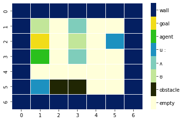
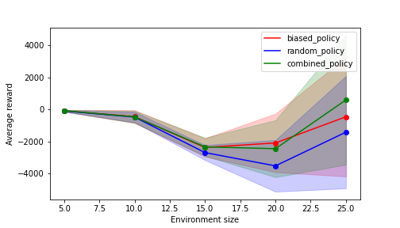

# Reinforcement Learning and Deep Reinforcement Learning


**<h2><div>1. Introduction</h2></div>** 

This repository contains three reinforcement learning tasks. 
1. A customised phoneme environment and arbitrary policies
2. Build a Q-learning agent that trains on the phoneme environment
3. Advanced implementation of Deep Reinforcement Learning Soft Actor-Critic to train continuous gym environments: LunarLander-v2 and BipedalWalker-v3

The scope and results of each task are summarised below.

**<h3><div>2. Task 1</h3></div>**

For this task, a custom phonetic environment was built. The agent's mission is to identify words with one of 
the phonetic sounds of the IPA English alphabet:  **ʊ**, **ʌ**, **uː** whilst avoiding hitting 
environment boundaries and movable obstacles. The agent was trained with three arbitrary policies: random, 
biased, and combination. This task illustrates the learning process and the impact of environment design, including the size of the grid,
reward, the number of phonemes in the grid and moving obstacles in the agent's performance 
(Figure 1)

**<h4><div> 2.1 Environment</div></h4>**

The phoneme environment is a configurable N x M array of integers representing objects.
All objects except the wall are placed randomly in the environment. Each object is represented as follows:

- 0: empty cell
- 1: moving obstacle
- 2: 'ʊ' word
- 3: 'ʌ' word
- 4: 'u:' word
- 5: Agent
- 6: Goal
- 7: Boundaries/walls

The words are randomly from the phoneme list. The grid can be adapted to collect the three 
sounds or any of their combinations with a minimal change in the rewards and policies functions. For a more advanced task, each word with the same sound can be encoded with a number. In this work, the mission is to collect/learn the phonetic sound 'ʊ'.

- The available area to place objects is the total grid area - the boundary area

a = M x N - 2 x (M + N) - 4

- The total number of words on the grid and moveable obstacles are given by floor division of the empty 
  cells (refer to the notebook in the associated documents for the full description)

  
- There is only one goal (G) and one learner (A)

**<h4><div> 2.2 Actions</div></h4>**

The actions available at each time step are:
- up
- down
- left 
- right
- grab 
After undertaking an action, the agent gets a reward and transitions to a new state. Then the environment sends a signal indicating whether the game is over or not. 


**<h4><div> 2.3 Observations</div></h4>**

The observation of the environment is a dictionary that contains
- relative coordinates to all words in the grid
- relative coordinates to the goal 
- relative coordinates to the obstacles
- a neighbourhood 3x3 array with the encoded values 
- a counter indicating the words left
- relative distance to the obstacles
- the current location of the agent


**<h4><div> 2.4 Policies</div></h4>**
- Goal-oriented "Biased policy" - only grabs sounds when at the same position of the sound to a 
  defined sound and 
  searches for the Goal.
- Random policy - takes actions randomly if not sound at the same location.
- Combined policy - with p = epsilon explores, otherwise follows the biased policy.


**<h4><div>2.5 Rewards</div></h4>**

- -1 per each time step
- -20 for hitting a moving obstacle 
- -10 for grabbing in an empty cell or hitting a wall
- -10 for grabbing a word with the 'ʊ' sound
- -20 for grabbing ʌ_pos and uː
- 100 if grabbing the correct sound

-  reaching the goal if all ʊ were collected  area  x phonemes collected
-  reaching the goal and ʊ left area x (total phonemes - phonemes connected)

#### Associated file
1. ```t1_phoneme_environment.ipynb``` - the Jupyter notebook with the class environment, policies, comparison and visualisation of the stats


 __A__   __B__

Figure 1. __A__ Configurable phonetic environment size 7 x 7.  __B__.
Policies comparison at different environment configurations after 50 epochs
of training.


#### Associated file
1. ```t1_phoneme_environment.ipynb``` - the Jupyter notebook with the class environment, policies, comparison and visualisation of the stats


### Task 2

In this task, the agent follows the Q-learning algorithm (off-policy algorithm) for the learning 
process. The reward 
per 
episode remarkedly improves in comparison with task 1. The effect of the environment size, epsilon and alphas on the learning process was also compared.

<figure>   
<figcaption  >  Figure 2. Comparison of the Q-agent performance in an environment size 10 x 
10 with learning rates and expsilons of 0.1, 0.5 and 1.0 and 30,000 training epochs.
</figcaption>
</figure>

#### Associated files
1. ```phonemes.py``` – the class environment
2. ```plotting.py``` - a function to visualise the statistics from training
3. ```t2_qlearning.ipynb``` - the Jupyter notebook of the  q-learning implementation.


### Task 3 

The advanced algorithm, Soft Actor-Critic (SAC), combined policy and value-based methods in this task. The agent learns the Policy and the Value function. Two gym continuous environments experiments were used in this task:
- LunarLander-v2
- BipedalWalker-v3

The LunarLander-v2 Continuos environment is complete after when the agent reaches a reward of >= 200.
The BipedalWalker-v3 Continuos environment is complete after 100 consecutive episodes with an average reward >= 300.

The best results are summarised in Table 1.

Table 1. Training results of the continuos gym environments Lunar-Lander-v2 and BipedalWalker-v3 
with the Soft Actor-Critic algorithm. The actor and critics had three hidden layers with 256 
hidden units. The batch size was set to 256.

|Exp   | Environment	    | Memory | Learning rate	<br> actor / critic|  tau  | reward <br> scale | Exploration |  Epochs  | steps<br> to learn |
|:----:|:-----------------|:------:|:------------------:|:-----:|:-----------------:|:-----------:|:--------:|:----------------------------:|
|Exp-01| LunarLander-v2   |  5e5   |   0.0003 / 0.0003  | 0.005 |         1         |    1000     | 500      |      104877<sup>1</sup>       | 
|Exp-02| LunarLander-v2   |  5e5   |   0.0005 / 0.0003  | 0.01  |         0.5       |    1000     | 500      |      111323<sup>1</sup>         |
|Exp-03| LunarLander-v2   |  5e5   |   0.0005 / 0.0003  | 0.05  |         1         |    1000     | 500      |      82458<sup>1</sup>         |
|Exp-04| BipedalWalker-v3 |  5e5   |   0.0001 / 0.0001  | 0.01  |         1         |    1000     | 600      |       348007                   | 
|Exp-05| BipedalWalker-v3 |  1e5   |   0.0001/ 0.00005  | 0.01  |         1         |    1000     | 500      |            364085              |
|Exp-06| BipedalWalker-v3 |  5e5   |   0.0001/ 0.0002   | 0.05  |         1         |    1000     | 700      |        455524<sup>2</sup>     |

<sup>1</sup> Solve the environment in the learning steps.

<sup>2</sup> Solved the envriroment with steps to learn from a total of 617406 steps.


__A____B____C__

  <p align="center">
      Figure 3. LunarLander-v2 Continuous training graphs. A. Experiment Exp-01. B Experiment Exp-02 . C Experiment Exp-03.
  </p>

__A____B____C__ 

 <p align="center">
      Figure 4. BipedalWalker-v3 Continuous training graphs. A. Experiment Exp-04. B Experiment Exp-05 . C Experiment Exp-06.
 </p>

https://user-images.githubusercontent.com/120340996/224035224-b9781120-5825-4484-8113-3957487f448c.mp4


https://github.com/Wb-az/Reinforcement-Learning/assets/120340996/a1a4970d-bf76-445a-a70c-ae7b81d28e35


#### Associated files (six)
1. ```utils``` – this folder contains four .py files:
-	```networks_architecture.py``` which contains policy, value function and critic approximators
-	```memory.py``` - a method to save the agent transitions
-	```sac.py``` - the implementation of the SAC algorithm
-	```plotting``` - a function to visualise the statistics from training

2. ```main.py``` - trains and evaluate the performance of the agent 
3. ```t3_sac_main.ipynb``` - the Jupyter notebook version of the main, designed to run on Google collab GPUs 


